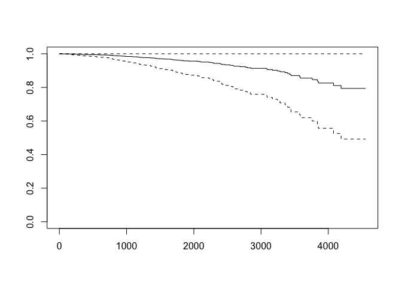

Sample_size_na_test&cox model
================
Yida Wang
2022-10-15

# Sample Size Analysis

``` r
data = read_csv('cirrhosis.csv')
```

    ## Rows: 418 Columns: 20
    ## ── Column specification ────────────────────────────────────────────────────────
    ## Delimiter: ","
    ## chr  (7): Status, Drug, Sex, Ascites, Hepatomegaly, Spiders, Edema
    ## dbl (13): ID, N_Days, Age, Bilirubin, Cholesterol, Albumin, Copper, Alk_Phos...
    ## 
    ## ℹ Use `spec()` to retrieve the full column specification for this data.
    ## ℹ Specify the column types or set `show_col_types = FALSE` to quiet this message.

``` r
data = 
  data %>%
  janitor::clean_names() %>%
  mutate(status = as.factor(status),
         drug = as.factor(drug),
         sex = as.factor(sex),
         ascites = as.factor(ascites),
         hepatomegaly = as.factor(hepatomegaly),
         spiders = as.factor(spiders),
         edema = as.factor(edema),
         stage = as.factor(stage))

# age in days, if we want to convert age to years:
# data['age'] = (data['age']/365) %>% round(0)

data
```

    ## # A tibble: 418 × 20
    ##       id n_days status drug      age sex   ascites hepat…¹ spiders edema bilir…²
    ##    <dbl>  <dbl> <fct>  <fct>   <dbl> <fct> <fct>   <fct>   <fct>   <fct>   <dbl>
    ##  1     1    400 D      D-peni… 21464 F     Y       Y       Y       Y        14.5
    ##  2     2   4500 C      D-peni… 20617 F     N       Y       Y       N         1.1
    ##  3     3   1012 D      D-peni… 25594 M     N       N       N       S         1.4
    ##  4     4   1925 D      D-peni… 19994 F     N       Y       Y       S         1.8
    ##  5     5   1504 CL     Placebo 13918 F     N       Y       Y       N         3.4
    ##  6     6   2503 D      Placebo 24201 F     N       Y       N       N         0.8
    ##  7     7   1832 C      Placebo 20284 F     N       Y       N       N         1  
    ##  8     8   2466 D      Placebo 19379 F     N       N       N       N         0.3
    ##  9     9   2400 D      D-peni… 15526 F     N       N       Y       N         3.2
    ## 10    10     51 D      Placebo 25772 F     Y       N       Y       Y        12.6
    ## # … with 408 more rows, 9 more variables: cholesterol <dbl>, albumin <dbl>,
    ## #   copper <dbl>, alk_phos <dbl>, sgot <dbl>, tryglicerides <dbl>,
    ## #   platelets <dbl>, prothrombin <dbl>, stage <fct>, and abbreviated variable
    ## #   names ¹​hepatomegaly, ²​bilirubin

``` r
data %>% 
  filter(drug=="Placebo") %>% 
  group_by(drug) %>% 
  count(drug)
```

    ## # A tibble: 1 × 2
    ## # Groups:   drug [1]
    ##   drug        n
    ##   <fct>   <int>
    ## 1 Placebo   154

``` r
data %>% 
  filter(drug=="D-penicillamine") %>% 
  group_by(drug) %>% 
  count(drug)
```

    ## # A tibble: 1 × 2
    ## # Groups:   drug [1]
    ##   drug                n
    ##   <fct>           <int>
    ## 1 D-penicillamine   158

``` r
data_no_na = data %>% na.omit()
```

``` r
control_1=data_no_na %>% 
  filter(drug=="Placebo") %>% 
  group_by(drug)
control_1%>% 
  count(drug)
```

    ## # A tibble: 1 × 2
    ## # Groups:   drug [1]
    ##   drug        n
    ##   <fct>   <int>
    ## 1 Placebo   140

``` r
treatment_1=data_no_na %>% 
  filter(drug=="D-penicillamine") %>% 
  group_by(drug) 
treatment_1%>% 
  count(drug)
```

    ## # A tibble: 1 × 2
    ## # Groups:   drug [1]
    ##   drug                n
    ##   <fct>           <int>
    ## 1 D-penicillamine   136

``` r
mean1=mean(control_1$n_days)
mean2=mean(treatment_1$n_days)
mean1
```

    ## [1] 2000.321

``` r
mean2
```

    ## [1] 1957.39

``` r
sd1=sd(control_1$n_days)
sd2=sd(treatment_1$n_days)
sd1
```

    ## [1] 1138.655

``` r
sd2
```

    ## [1] 1088.447

``` r
sd_pooled=sqrt((sd1^2+sd2^2)/2)
es=(mean1-mean2)/sd_pooled
es
```

    ## [1] 0.0385441

``` r
median1=median(control_1$n_days)
median2=median(treatment_1$n_days)
es1=(median1-median2)/sd_pooled
es1
```

    ## [1] -0.0076313

80%power-Z:0.84

``` r
((1.96-1.28)/log(median2/median1))^2
```

    ## [1] 20557.75

``` r
pwr.t.test(d=es, sig.level=0.05, power=0.80, type='two.sample', alternative='greate')
```

    ## 
    ##      Two-sample t test power calculation 
    ## 
    ##               n = 8323.722
    ##               d = 0.0385441
    ##       sig.level = 0.05
    ##           power = 0.8
    ##     alternative = greater
    ## 
    ## NOTE: n is number in *each* group

Assign Placebo as the reference with 50% response rate. We assume that
D-penicillamine is slightly better with a response rate of 60%.
$$p_1=0.6, p_2=0.5$$Therefore, we have:

``` r
power1 <-pwr.2p.test(h = ES.h(p1 = 0.7, p2 = 0.50), sig.level = 0.05, power = .80)
power1
```

    ## 
    ##      Difference of proportion power calculation for binomial distribution (arcsine transformation) 
    ## 
    ##               h = 0.4115168
    ##               n = 92.69608
    ##       sig.level = 0.05
    ##           power = 0.8
    ##     alternative = two.sided
    ## 
    ## NOTE: same sample sizes

``` r
plot(power1)
```

<!-- -->

``` r
expLogMeanDeaths = function(Delta, alpha, pwr){
  z.alpha = qnorm(alpha, lower.tail=F)
  z.beta = qnorm(1-pwr, lower.tail=F)
  num = (z.alpha + z.beta)^2
  denom = (log(Delta))^2
  dd = num/denom
  dd
}
```

``` r
# Log-mean based approach
expLogMeanDeaths(Delta = 1.004754, alpha = 0.05, pwr = 0.8)
```

    ## [1] 274859.2

## cox model

``` r
library(survival)
pbc_data = 
  read_csv("./cirrhosis.csv") %>% 
  janitor::clean_names() %>%
  mutate(status = as.factor(status),
         drug = as.factor(drug),
         sex = as.factor(sex),
         ascites = as.factor(ascites),
         hepatomegaly = as.factor(hepatomegaly),
         spiders = as.factor(spiders),
         edema = as.factor(edema),
         stage = as.factor(stage)) %>% 
  mutate(status=recode(status,"D" =1, "C"=0,"CL"=0))
```

    ## Rows: 418 Columns: 20
    ## ── Column specification ────────────────────────────────────────────────────────
    ## Delimiter: ","
    ## chr  (7): Status, Drug, Sex, Ascites, Hepatomegaly, Spiders, Edema
    ## dbl (13): ID, N_Days, Age, Bilirubin, Cholesterol, Albumin, Copper, Alk_Phos...
    ## 
    ## ℹ Use `spec()` to retrieve the full column specification for this data.
    ## ℹ Specify the column types or set `show_col_types = FALSE` to quiet this message.

``` r
pbc_data_1 = 
  pbc_data %>% 
  drop_na(drug)

futime=Surv(pbc_data_1$n_days,pbc_data_1$status)
```

# distribution of raw

``` r
library(ggplot2)
ggplot(pbc_data_1, aes(x=n_days, fill=factor(drug))) + 
  geom_density(alpha=0.25)+
  labs(title = "Distribution of Survival Time for Two Group")
```

<!-- -->

``` r
#hist(pbc_data_1$n_days)
```

``` r
res.cox <- coxph(futime ~ drug + age + sex + ascites + hepatomegaly + 
                   spiders + edema + bilirubin + cholesterol + albumin + copper + alk_phos + 
                   sgot + tryglicerides +platelets+ prothrombin + stage , data = pbc_data_1)
test.ph <- cox.zph(res.cox)
test.ph
```

    ##                  chisq df      p
    ## drug           0.23988  1 0.6243
    ## age            1.91620  1 0.1663
    ## sex            0.00231  1 0.9617
    ## ascites        1.80196  1 0.1795
    ## hepatomegaly   0.10709  1 0.7435
    ## spiders        0.59045  1 0.4422
    ## edema          5.40191  2 0.0671
    ## bilirubin      7.68884  1 0.0056
    ## cholesterol   10.53819  1 0.0012
    ## albumin        0.11941  1 0.7297
    ## copper         0.14099  1 0.7073
    ## alk_phos       1.45071  1 0.2284
    ## sgot           1.28065  1 0.2578
    ## tryglicerides  3.99531  1 0.0456
    ## platelets      1.73195  1 0.1882
    ## prothrombin    3.96932  1 0.0463
    ## stage          3.69074  3 0.2969
    ## GLOBAL        28.89383 20 0.0899

``` r
broom::tidy(res.cox)
```

    ## # A tibble: 20 × 5
    ##    term              estimate std.error statistic p.value
    ##    <chr>                <dbl>     <dbl>     <dbl>   <dbl>
    ##  1 drugPlacebo   -0.176       0.219      -0.806   0.420  
    ##  2 age            0.0000791   0.0000319   2.48    0.0130 
    ##  3 sexM           0.376       0.311       1.21    0.227  
    ##  4 ascitesY       0.000590    0.395       0.00149 0.999  
    ##  5 hepatomegalyY  0.0565      0.257       0.220   0.826  
    ##  6 spidersY       0.0701      0.249       0.281   0.778  
    ##  7 edemaS         0.244       0.335       0.726   0.468  
    ##  8 edemaY         1.15        0.417       2.75    0.00595
    ##  9 bilirubin      0.0801      0.0263      3.05    0.00229
    ## 10 cholesterol    0.000473    0.000453    1.04    0.297  
    ## 11 albumin       -0.750       0.310      -2.42    0.0157 
    ## 12 copper         0.00244     0.00117     2.09    0.0369 
    ## 13 alk_phos       0.000000523 0.0000407   0.0129  0.990  
    ## 14 sgot           0.00371     0.00199     1.86    0.0625 
    ## 15 tryglicerides -0.000518    0.00144    -0.361   0.718  
    ## 16 platelets      0.000841    0.00119     0.707   0.479  
    ## 17 prothrombin    0.276       0.117       2.37    0.0179 
    ## 18 stage2         1.41        1.08        1.30    0.193  
    ## 19 stage3         1.68        1.05        1.60    0.110  
    ## 20 stage4         2.12        1.07        1.99    0.0471

\#general survival curve

``` r
plot(surv_fit(res.cox, data=pbc_data_1))
```

<!-- -->

``` r
strata1 <- coxph(futime ~ drug + age + strata(sex) + ascites + hepatomegaly + 
                   spiders + edema + bilirubin + cholesterol + albumin + copper + alk_phos + 
                   sgot + tryglicerides +platelets+ prothrombin + stage , data = pbc_data_1)

plot(surv_fit(strata1, pbc_data_1))
```

<!-- -->
