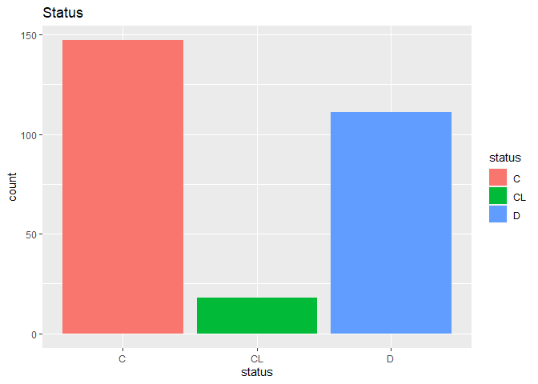

Cirrhosis Descriptive Statistics
================

Data

``` r
data = read_csv('cirrhosis.csv')
```

    ## Rows: 418 Columns: 20
    ## -- Column specification --------------------------------------------------------
    ## Delimiter: ","
    ## chr  (7): Status, Drug, Sex, Ascites, Hepatomegaly, Spiders, Edema
    ## dbl (13): ID, N_Days, Age, Bilirubin, Cholesterol, Albumin, Copper, Alk_Phos...
    ## 
    ## i Use `spec()` to retrieve the full column specification for this data.
    ## i Specify the column types or set `show_col_types = FALSE` to quiet this message.

``` r
data = 
  data %>%
  janitor::clean_names() %>%
  mutate(status = as.factor(status),
         drug = as.factor(drug),
         sex = as.factor(sex),
         ascites = as.factor(ascites),
         hepatomegaly = as.factor(hepatomegaly),
         spiders = as.factor(spiders),
         edema = as.factor(edema),
         stage = as.factor(stage))

data_no_na = data %>% na.omit()
  

summary(data)
```

    ##        id            n_days     status                drug          age       
    ##  Min.   :  1.0   Min.   :  41   C :232   D-penicillamine:158   Min.   : 9598  
    ##  1st Qu.:105.2   1st Qu.:1093   CL: 25   Placebo        :154   1st Qu.:15644  
    ##  Median :209.5   Median :1730   D :161   NA's           :106   Median :18628  
    ##  Mean   :209.5   Mean   :1918                                  Mean   :18533  
    ##  3rd Qu.:313.8   3rd Qu.:2614                                  3rd Qu.:21273  
    ##  Max.   :418.0   Max.   :4795                                  Max.   :28650  
    ##                                                                               
    ##  sex     ascites    hepatomegaly spiders    edema     bilirubin     
    ##  F:374   N   :288   N   :152     N   :222   N:354   Min.   : 0.300  
    ##  M: 44   Y   : 24   Y   :160     Y   : 90   S: 44   1st Qu.: 0.800  
    ##          NA's:106   NA's:106     NA's:106   Y: 20   Median : 1.400  
    ##                                                     Mean   : 3.221  
    ##                                                     3rd Qu.: 3.400  
    ##                                                     Max.   :28.000  
    ##                                                                     
    ##   cholesterol        albumin          copper          alk_phos      
    ##  Min.   : 120.0   Min.   :1.960   Min.   :  4.00   Min.   :  289.0  
    ##  1st Qu.: 249.5   1st Qu.:3.243   1st Qu.: 41.25   1st Qu.:  871.5  
    ##  Median : 309.5   Median :3.530   Median : 73.00   Median : 1259.0  
    ##  Mean   : 369.5   Mean   :3.497   Mean   : 97.65   Mean   : 1982.7  
    ##  3rd Qu.: 400.0   3rd Qu.:3.770   3rd Qu.:123.00   3rd Qu.: 1980.0  
    ##  Max.   :1775.0   Max.   :4.640   Max.   :588.00   Max.   :13862.4  
    ##  NA's   :134                      NA's   :108      NA's   :106      
    ##       sgot        tryglicerides      platelets      prothrombin     stage    
    ##  Min.   : 26.35   Min.   : 33.00   Min.   : 62.0   Min.   : 9.00   1   : 21  
    ##  1st Qu.: 80.60   1st Qu.: 84.25   1st Qu.:188.5   1st Qu.:10.00   2   : 92  
    ##  Median :114.70   Median :108.00   Median :251.0   Median :10.60   3   :155  
    ##  Mean   :122.56   Mean   :124.70   Mean   :257.0   Mean   :10.73   4   :144  
    ##  3rd Qu.:151.90   3rd Qu.:151.00   3rd Qu.:318.0   3rd Qu.:11.10   NA's:  6  
    ##  Max.   :457.25   Max.   :598.00   Max.   :721.0   Max.   :18.00             
    ##  NA's   :106      NA's   :136      NA's   :11      NA's   :2

``` r
# note: age in days
```

Basic summary

``` r
table1 = 
  tbl_summary(
    data[ ,2:20],
    by = drug, 
    missing = "no" 
  ) %>%
  add_n() %>% # total number of non-missing observations
  add_p() %>% # difference between groups
  add_overall() %>%
  modify_header(label = "**Variable**") %>% 
  bold_labels()

knitr::knit_print(table1)
```

<div id="uvaffhpgoe" style="overflow-x:auto;overflow-y:auto;width:auto;height:auto;">
<style>html {
  font-family: -apple-system, BlinkMacSystemFont, 'Segoe UI', Roboto, Oxygen, Ubuntu, Cantarell, 'Helvetica Neue', 'Fira Sans', 'Droid Sans', Arial, sans-serif;
}

#uvaffhpgoe .gt_table {
  display: table;
  border-collapse: collapse;
  margin-left: auto;
  margin-right: auto;
  color: #333333;
  font-size: 16px;
  font-weight: normal;
  font-style: normal;
  background-color: #FFFFFF;
  width: auto;
  border-top-style: solid;
  border-top-width: 2px;
  border-top-color: #A8A8A8;
  border-right-style: none;
  border-right-width: 2px;
  border-right-color: #D3D3D3;
  border-bottom-style: solid;
  border-bottom-width: 2px;
  border-bottom-color: #A8A8A8;
  border-left-style: none;
  border-left-width: 2px;
  border-left-color: #D3D3D3;
}

#uvaffhpgoe .gt_heading {
  background-color: #FFFFFF;
  text-align: center;
  border-bottom-color: #FFFFFF;
  border-left-style: none;
  border-left-width: 1px;
  border-left-color: #D3D3D3;
  border-right-style: none;
  border-right-width: 1px;
  border-right-color: #D3D3D3;
}

#uvaffhpgoe .gt_title {
  color: #333333;
  font-size: 125%;
  font-weight: initial;
  padding-top: 4px;
  padding-bottom: 4px;
  padding-left: 5px;
  padding-right: 5px;
  border-bottom-color: #FFFFFF;
  border-bottom-width: 0;
}

#uvaffhpgoe .gt_subtitle {
  color: #333333;
  font-size: 85%;
  font-weight: initial;
  padding-top: 0;
  padding-bottom: 6px;
  padding-left: 5px;
  padding-right: 5px;
  border-top-color: #FFFFFF;
  border-top-width: 0;
}

#uvaffhpgoe .gt_bottom_border {
  border-bottom-style: solid;
  border-bottom-width: 2px;
  border-bottom-color: #D3D3D3;
}

#uvaffhpgoe .gt_col_headings {
  border-top-style: solid;
  border-top-width: 2px;
  border-top-color: #D3D3D3;
  border-bottom-style: solid;
  border-bottom-width: 2px;
  border-bottom-color: #D3D3D3;
  border-left-style: none;
  border-left-width: 1px;
  border-left-color: #D3D3D3;
  border-right-style: none;
  border-right-width: 1px;
  border-right-color: #D3D3D3;
}

#uvaffhpgoe .gt_col_heading {
  color: #333333;
  background-color: #FFFFFF;
  font-size: 100%;
  font-weight: normal;
  text-transform: inherit;
  border-left-style: none;
  border-left-width: 1px;
  border-left-color: #D3D3D3;
  border-right-style: none;
  border-right-width: 1px;
  border-right-color: #D3D3D3;
  vertical-align: bottom;
  padding-top: 5px;
  padding-bottom: 6px;
  padding-left: 5px;
  padding-right: 5px;
  overflow-x: hidden;
}

#uvaffhpgoe .gt_column_spanner_outer {
  color: #333333;
  background-color: #FFFFFF;
  font-size: 100%;
  font-weight: normal;
  text-transform: inherit;
  padding-top: 0;
  padding-bottom: 0;
  padding-left: 4px;
  padding-right: 4px;
}

#uvaffhpgoe .gt_column_spanner_outer:first-child {
  padding-left: 0;
}

#uvaffhpgoe .gt_column_spanner_outer:last-child {
  padding-right: 0;
}

#uvaffhpgoe .gt_column_spanner {
  border-bottom-style: solid;
  border-bottom-width: 2px;
  border-bottom-color: #D3D3D3;
  vertical-align: bottom;
  padding-top: 5px;
  padding-bottom: 5px;
  overflow-x: hidden;
  display: inline-block;
  width: 100%;
}

#uvaffhpgoe .gt_group_heading {
  padding-top: 8px;
  padding-bottom: 8px;
  padding-left: 5px;
  padding-right: 5px;
  color: #333333;
  background-color: #FFFFFF;
  font-size: 100%;
  font-weight: initial;
  text-transform: inherit;
  border-top-style: solid;
  border-top-width: 2px;
  border-top-color: #D3D3D3;
  border-bottom-style: solid;
  border-bottom-width: 2px;
  border-bottom-color: #D3D3D3;
  border-left-style: none;
  border-left-width: 1px;
  border-left-color: #D3D3D3;
  border-right-style: none;
  border-right-width: 1px;
  border-right-color: #D3D3D3;
  vertical-align: middle;
}

#uvaffhpgoe .gt_empty_group_heading {
  padding: 0.5px;
  color: #333333;
  background-color: #FFFFFF;
  font-size: 100%;
  font-weight: initial;
  border-top-style: solid;
  border-top-width: 2px;
  border-top-color: #D3D3D3;
  border-bottom-style: solid;
  border-bottom-width: 2px;
  border-bottom-color: #D3D3D3;
  vertical-align: middle;
}

#uvaffhpgoe .gt_from_md > :first-child {
  margin-top: 0;
}

#uvaffhpgoe .gt_from_md > :last-child {
  margin-bottom: 0;
}

#uvaffhpgoe .gt_row {
  padding-top: 8px;
  padding-bottom: 8px;
  padding-left: 5px;
  padding-right: 5px;
  margin: 10px;
  border-top-style: solid;
  border-top-width: 1px;
  border-top-color: #D3D3D3;
  border-left-style: none;
  border-left-width: 1px;
  border-left-color: #D3D3D3;
  border-right-style: none;
  border-right-width: 1px;
  border-right-color: #D3D3D3;
  vertical-align: middle;
  overflow-x: hidden;
}

#uvaffhpgoe .gt_stub {
  color: #333333;
  background-color: #FFFFFF;
  font-size: 100%;
  font-weight: initial;
  text-transform: inherit;
  border-right-style: solid;
  border-right-width: 2px;
  border-right-color: #D3D3D3;
  padding-left: 5px;
  padding-right: 5px;
}

#uvaffhpgoe .gt_stub_row_group {
  color: #333333;
  background-color: #FFFFFF;
  font-size: 100%;
  font-weight: initial;
  text-transform: inherit;
  border-right-style: solid;
  border-right-width: 2px;
  border-right-color: #D3D3D3;
  padding-left: 5px;
  padding-right: 5px;
  vertical-align: top;
}

#uvaffhpgoe .gt_row_group_first td {
  border-top-width: 2px;
}

#uvaffhpgoe .gt_summary_row {
  color: #333333;
  background-color: #FFFFFF;
  text-transform: inherit;
  padding-top: 8px;
  padding-bottom: 8px;
  padding-left: 5px;
  padding-right: 5px;
}

#uvaffhpgoe .gt_first_summary_row {
  border-top-style: solid;
  border-top-color: #D3D3D3;
}

#uvaffhpgoe .gt_first_summary_row.thick {
  border-top-width: 2px;
}

#uvaffhpgoe .gt_last_summary_row {
  padding-top: 8px;
  padding-bottom: 8px;
  padding-left: 5px;
  padding-right: 5px;
  border-bottom-style: solid;
  border-bottom-width: 2px;
  border-bottom-color: #D3D3D3;
}

#uvaffhpgoe .gt_grand_summary_row {
  color: #333333;
  background-color: #FFFFFF;
  text-transform: inherit;
  padding-top: 8px;
  padding-bottom: 8px;
  padding-left: 5px;
  padding-right: 5px;
}

#uvaffhpgoe .gt_first_grand_summary_row {
  padding-top: 8px;
  padding-bottom: 8px;
  padding-left: 5px;
  padding-right: 5px;
  border-top-style: double;
  border-top-width: 6px;
  border-top-color: #D3D3D3;
}

#uvaffhpgoe .gt_striped {
  background-color: rgba(128, 128, 128, 0.05);
}

#uvaffhpgoe .gt_table_body {
  border-top-style: solid;
  border-top-width: 2px;
  border-top-color: #D3D3D3;
  border-bottom-style: solid;
  border-bottom-width: 2px;
  border-bottom-color: #D3D3D3;
}

#uvaffhpgoe .gt_footnotes {
  color: #333333;
  background-color: #FFFFFF;
  border-bottom-style: none;
  border-bottom-width: 2px;
  border-bottom-color: #D3D3D3;
  border-left-style: none;
  border-left-width: 2px;
  border-left-color: #D3D3D3;
  border-right-style: none;
  border-right-width: 2px;
  border-right-color: #D3D3D3;
}

#uvaffhpgoe .gt_footnote {
  margin: 0px;
  font-size: 90%;
  padding-left: 4px;
  padding-right: 4px;
  padding-left: 5px;
  padding-right: 5px;
}

#uvaffhpgoe .gt_sourcenotes {
  color: #333333;
  background-color: #FFFFFF;
  border-bottom-style: none;
  border-bottom-width: 2px;
  border-bottom-color: #D3D3D3;
  border-left-style: none;
  border-left-width: 2px;
  border-left-color: #D3D3D3;
  border-right-style: none;
  border-right-width: 2px;
  border-right-color: #D3D3D3;
}

#uvaffhpgoe .gt_sourcenote {
  font-size: 90%;
  padding-top: 4px;
  padding-bottom: 4px;
  padding-left: 5px;
  padding-right: 5px;
}

#uvaffhpgoe .gt_left {
  text-align: left;
}

#uvaffhpgoe .gt_center {
  text-align: center;
}

#uvaffhpgoe .gt_right {
  text-align: right;
  font-variant-numeric: tabular-nums;
}

#uvaffhpgoe .gt_font_normal {
  font-weight: normal;
}

#uvaffhpgoe .gt_font_bold {
  font-weight: bold;
}

#uvaffhpgoe .gt_font_italic {
  font-style: italic;
}

#uvaffhpgoe .gt_super {
  font-size: 65%;
}

#uvaffhpgoe .gt_footnote_marks {
  font-style: italic;
  font-weight: normal;
  font-size: 75%;
  vertical-align: 0.4em;
}

#uvaffhpgoe .gt_asterisk {
  font-size: 100%;
  vertical-align: 0;
}

#uvaffhpgoe .gt_indent_1 {
  text-indent: 5px;
}

#uvaffhpgoe .gt_indent_2 {
  text-indent: 10px;
}

#uvaffhpgoe .gt_indent_3 {
  text-indent: 15px;
}

#uvaffhpgoe .gt_indent_4 {
  text-indent: 20px;
}

#uvaffhpgoe .gt_indent_5 {
  text-indent: 25px;
}
</style>
<table class="gt_table">
  
  <thead class="gt_col_headings">
    <tr>
      <th class="gt_col_heading gt_columns_bottom_border gt_left" rowspan="1" colspan="1" scope="col"><strong>Variable</strong></th>
      <th class="gt_col_heading gt_columns_bottom_border gt_center" rowspan="1" colspan="1" scope="col"><strong>N</strong></th>
      <th class="gt_col_heading gt_columns_bottom_border gt_center" rowspan="1" colspan="1" scope="col"><strong>Overall</strong>, N = 312<sup class="gt_footnote_marks">1</sup></th>
      <th class="gt_col_heading gt_columns_bottom_border gt_center" rowspan="1" colspan="1" scope="col"><strong>D-penicillamine</strong>, N = 158<sup class="gt_footnote_marks">1</sup></th>
      <th class="gt_col_heading gt_columns_bottom_border gt_center" rowspan="1" colspan="1" scope="col"><strong>Placebo</strong>, N = 154<sup class="gt_footnote_marks">1</sup></th>
      <th class="gt_col_heading gt_columns_bottom_border gt_center" rowspan="1" colspan="1" scope="col"><strong>p-value</strong><sup class="gt_footnote_marks">2</sup></th>
    </tr>
  </thead>
  <tbody class="gt_table_body">
    <tr><td class="gt_row gt_left" style="font-weight: bold;">n_days</td>
<td class="gt_row gt_center">312</td>
<td class="gt_row gt_center">1,840 (1,191, 2,697)</td>
<td class="gt_row gt_center">1,895 (1,231, 2,632)</td>
<td class="gt_row gt_center">1,811 (1,153, 2,771)</td>
<td class="gt_row gt_center">0.8</td></tr>
    <tr><td class="gt_row gt_left" style="font-weight: bold;">status</td>
<td class="gt_row gt_center">312</td>
<td class="gt_row gt_center"></td>
<td class="gt_row gt_center"></td>
<td class="gt_row gt_center"></td>
<td class="gt_row gt_center">0.9</td></tr>
    <tr><td class="gt_row gt_left">    C</td>
<td class="gt_row gt_center"></td>
<td class="gt_row gt_center">168 (54%)</td>
<td class="gt_row gt_center">83 (53%)</td>
<td class="gt_row gt_center">85 (55%)</td>
<td class="gt_row gt_center"></td></tr>
    <tr><td class="gt_row gt_left">    CL</td>
<td class="gt_row gt_center"></td>
<td class="gt_row gt_center">19 (6.1%)</td>
<td class="gt_row gt_center">10 (6.3%)</td>
<td class="gt_row gt_center">9 (5.8%)</td>
<td class="gt_row gt_center"></td></tr>
    <tr><td class="gt_row gt_left">    D</td>
<td class="gt_row gt_center"></td>
<td class="gt_row gt_center">125 (40%)</td>
<td class="gt_row gt_center">65 (41%)</td>
<td class="gt_row gt_center">60 (39%)</td>
<td class="gt_row gt_center"></td></tr>
    <tr><td class="gt_row gt_left" style="font-weight: bold;">age</td>
<td class="gt_row gt_center">312</td>
<td class="gt_row gt_center">18,188 (15,428, 20,715)</td>
<td class="gt_row gt_center">18,968 (15,698, 21,515)</td>
<td class="gt_row gt_center">17,572 (15,134, 20,382)</td>
<td class="gt_row gt_center">0.020</td></tr>
    <tr><td class="gt_row gt_left" style="font-weight: bold;">sex</td>
<td class="gt_row gt_center">312</td>
<td class="gt_row gt_center"></td>
<td class="gt_row gt_center"></td>
<td class="gt_row gt_center"></td>
<td class="gt_row gt_center">0.3</td></tr>
    <tr><td class="gt_row gt_left">    F</td>
<td class="gt_row gt_center"></td>
<td class="gt_row gt_center">276 (88%)</td>
<td class="gt_row gt_center">137 (87%)</td>
<td class="gt_row gt_center">139 (90%)</td>
<td class="gt_row gt_center"></td></tr>
    <tr><td class="gt_row gt_left">    M</td>
<td class="gt_row gt_center"></td>
<td class="gt_row gt_center">36 (12%)</td>
<td class="gt_row gt_center">21 (13%)</td>
<td class="gt_row gt_center">15 (9.7%)</td>
<td class="gt_row gt_center"></td></tr>
    <tr><td class="gt_row gt_left" style="font-weight: bold;">ascites</td>
<td class="gt_row gt_center">312</td>
<td class="gt_row gt_center"></td>
<td class="gt_row gt_center"></td>
<td class="gt_row gt_center"></td>
<td class="gt_row gt_center">0.4</td></tr>
    <tr><td class="gt_row gt_left">    N</td>
<td class="gt_row gt_center"></td>
<td class="gt_row gt_center">288 (92%)</td>
<td class="gt_row gt_center">144 (91%)</td>
<td class="gt_row gt_center">144 (94%)</td>
<td class="gt_row gt_center"></td></tr>
    <tr><td class="gt_row gt_left">    Y</td>
<td class="gt_row gt_center"></td>
<td class="gt_row gt_center">24 (7.7%)</td>
<td class="gt_row gt_center">14 (8.9%)</td>
<td class="gt_row gt_center">10 (6.5%)</td>
<td class="gt_row gt_center"></td></tr>
    <tr><td class="gt_row gt_left" style="font-weight: bold;">hepatomegaly</td>
<td class="gt_row gt_center">312</td>
<td class="gt_row gt_center"></td>
<td class="gt_row gt_center"></td>
<td class="gt_row gt_center"></td>
<td class="gt_row gt_center">0.069</td></tr>
    <tr><td class="gt_row gt_left">    N</td>
<td class="gt_row gt_center"></td>
<td class="gt_row gt_center">152 (49%)</td>
<td class="gt_row gt_center">85 (54%)</td>
<td class="gt_row gt_center">67 (44%)</td>
<td class="gt_row gt_center"></td></tr>
    <tr><td class="gt_row gt_left">    Y</td>
<td class="gt_row gt_center"></td>
<td class="gt_row gt_center">160 (51%)</td>
<td class="gt_row gt_center">73 (46%)</td>
<td class="gt_row gt_center">87 (56%)</td>
<td class="gt_row gt_center"></td></tr>
    <tr><td class="gt_row gt_left" style="font-weight: bold;">spiders</td>
<td class="gt_row gt_center">312</td>
<td class="gt_row gt_center"></td>
<td class="gt_row gt_center"></td>
<td class="gt_row gt_center"></td>
<td class="gt_row gt_center">0.9</td></tr>
    <tr><td class="gt_row gt_left">    N</td>
<td class="gt_row gt_center"></td>
<td class="gt_row gt_center">222 (71%)</td>
<td class="gt_row gt_center">113 (72%)</td>
<td class="gt_row gt_center">109 (71%)</td>
<td class="gt_row gt_center"></td></tr>
    <tr><td class="gt_row gt_left">    Y</td>
<td class="gt_row gt_center"></td>
<td class="gt_row gt_center">90 (29%)</td>
<td class="gt_row gt_center">45 (28%)</td>
<td class="gt_row gt_center">45 (29%)</td>
<td class="gt_row gt_center"></td></tr>
    <tr><td class="gt_row gt_left" style="font-weight: bold;">edema</td>
<td class="gt_row gt_center">312</td>
<td class="gt_row gt_center"></td>
<td class="gt_row gt_center"></td>
<td class="gt_row gt_center"></td>
<td class="gt_row gt_center">0.9</td></tr>
    <tr><td class="gt_row gt_left">    N</td>
<td class="gt_row gt_center"></td>
<td class="gt_row gt_center">263 (84%)</td>
<td class="gt_row gt_center">132 (84%)</td>
<td class="gt_row gt_center">131 (85%)</td>
<td class="gt_row gt_center"></td></tr>
    <tr><td class="gt_row gt_left">    S</td>
<td class="gt_row gt_center"></td>
<td class="gt_row gt_center">29 (9.3%)</td>
<td class="gt_row gt_center">16 (10%)</td>
<td class="gt_row gt_center">13 (8.4%)</td>
<td class="gt_row gt_center"></td></tr>
    <tr><td class="gt_row gt_left">    Y</td>
<td class="gt_row gt_center"></td>
<td class="gt_row gt_center">20 (6.4%)</td>
<td class="gt_row gt_center">10 (6.3%)</td>
<td class="gt_row gt_center">10 (6.5%)</td>
<td class="gt_row gt_center"></td></tr>
    <tr><td class="gt_row gt_left" style="font-weight: bold;">bilirubin</td>
<td class="gt_row gt_center">312</td>
<td class="gt_row gt_center">1.4 (0.8, 3.4)</td>
<td class="gt_row gt_center">1.4 (0.8, 3.2)</td>
<td class="gt_row gt_center">1.3 (0.7, 3.6)</td>
<td class="gt_row gt_center">0.8</td></tr>
    <tr><td class="gt_row gt_left" style="font-weight: bold;">cholesterol</td>
<td class="gt_row gt_center">284</td>
<td class="gt_row gt_center">310 (250, 400)</td>
<td class="gt_row gt_center">316 (248, 417)</td>
<td class="gt_row gt_center">304 (254, 377)</td>
<td class="gt_row gt_center">0.5</td></tr>
    <tr><td class="gt_row gt_left" style="font-weight: bold;">albumin</td>
<td class="gt_row gt_center">312</td>
<td class="gt_row gt_center">3.55 (3.31, 3.80)</td>
<td class="gt_row gt_center">3.57 (3.21, 3.83)</td>
<td class="gt_row gt_center">3.54 (3.34, 3.78)</td>
<td class="gt_row gt_center">>0.9</td></tr>
    <tr><td class="gt_row gt_left" style="font-weight: bold;">copper</td>
<td class="gt_row gt_center">310</td>
<td class="gt_row gt_center">73 (41, 123)</td>
<td class="gt_row gt_center">73 (40, 121)</td>
<td class="gt_row gt_center">73 (43, 139)</td>
<td class="gt_row gt_center">0.7</td></tr>
    <tr><td class="gt_row gt_left" style="font-weight: bold;">alk_phos</td>
<td class="gt_row gt_center">312</td>
<td class="gt_row gt_center">1,259 (872, 1,980)</td>
<td class="gt_row gt_center">1,214 (841, 2,028)</td>
<td class="gt_row gt_center">1,283 (922, 1,950)</td>
<td class="gt_row gt_center">0.8</td></tr>
    <tr><td class="gt_row gt_left" style="font-weight: bold;">sgot</td>
<td class="gt_row gt_center">312</td>
<td class="gt_row gt_center">115 (81, 152)</td>
<td class="gt_row gt_center">112 (77, 152)</td>
<td class="gt_row gt_center">117 (84, 152)</td>
<td class="gt_row gt_center">0.5</td></tr>
    <tr><td class="gt_row gt_left" style="font-weight: bold;">tryglicerides</td>
<td class="gt_row gt_center">282</td>
<td class="gt_row gt_center">108 (84, 151)</td>
<td class="gt_row gt_center">106 (84, 146)</td>
<td class="gt_row gt_center">113 (84, 155)</td>
<td class="gt_row gt_center">0.4</td></tr>
    <tr><td class="gt_row gt_left" style="font-weight: bold;">platelets</td>
<td class="gt_row gt_center">308</td>
<td class="gt_row gt_center">257 (200, 322)</td>
<td class="gt_row gt_center">255 (190, 322)</td>
<td class="gt_row gt_center">260 (207, 322)</td>
<td class="gt_row gt_center">0.5</td></tr>
    <tr><td class="gt_row gt_left" style="font-weight: bold;">prothrombin</td>
<td class="gt_row gt_center">312</td>
<td class="gt_row gt_center">10.60 (10.00, 11.10)</td>
<td class="gt_row gt_center">10.60 (10.03, 11.00)</td>
<td class="gt_row gt_center">10.60 (10.00, 11.40)</td>
<td class="gt_row gt_center">0.6</td></tr>
    <tr><td class="gt_row gt_left" style="font-weight: bold;">stage</td>
<td class="gt_row gt_center">312</td>
<td class="gt_row gt_center"></td>
<td class="gt_row gt_center"></td>
<td class="gt_row gt_center"></td>
<td class="gt_row gt_center">0.2</td></tr>
    <tr><td class="gt_row gt_left">    1</td>
<td class="gt_row gt_center"></td>
<td class="gt_row gt_center">16 (5.1%)</td>
<td class="gt_row gt_center">12 (7.6%)</td>
<td class="gt_row gt_center">4 (2.6%)</td>
<td class="gt_row gt_center"></td></tr>
    <tr><td class="gt_row gt_left">    2</td>
<td class="gt_row gt_center"></td>
<td class="gt_row gt_center">67 (21%)</td>
<td class="gt_row gt_center">35 (22%)</td>
<td class="gt_row gt_center">32 (21%)</td>
<td class="gt_row gt_center"></td></tr>
    <tr><td class="gt_row gt_left">    3</td>
<td class="gt_row gt_center"></td>
<td class="gt_row gt_center">120 (38%)</td>
<td class="gt_row gt_center">56 (35%)</td>
<td class="gt_row gt_center">64 (42%)</td>
<td class="gt_row gt_center"></td></tr>
    <tr><td class="gt_row gt_left">    4</td>
<td class="gt_row gt_center"></td>
<td class="gt_row gt_center">109 (35%)</td>
<td class="gt_row gt_center">55 (35%)</td>
<td class="gt_row gt_center">54 (35%)</td>
<td class="gt_row gt_center"></td></tr>
  </tbody>
  
  <tfoot class="gt_footnotes">
    <tr>
      <td class="gt_footnote" colspan="6"><sup class="gt_footnote_marks">1</sup> Median (IQR); n (%)</td>
    </tr>
    <tr>
      <td class="gt_footnote" colspan="6"><sup class="gt_footnote_marks">2</sup> Wilcoxon rank sum test; Pearson's Chi-squared test</td>
    </tr>
  </tfoot>
</table>
</div>

Corrplot

``` r
data_cor = 
  data_no_na[ ,2:20] %>%
  mutate(status = recode(status, "C" = 1, "CL" = 2, "D" = 3), 
         # C=censored, CL=censored due to liver tx, D=death
         sex = recode(sex, "F" = 0, "M" = 1),
         # 0=female, 1=male
         drug = recode(drug, "Placebo" = 0, "D-penicillamine" = 1),
         # 0=placebo, 1=trt
         ascites = recode(ascites, "N" = 0, "Y" = 1),
         hepatomegaly = recode(hepatomegaly, "N" = 0, "Y" = 1),
         spiders = recode(spiders, "N" = 0, "Y" = 1),
         edema = recode(edema, "N" = 0, "S" = 1, "Y" = 2),
         # N = no edema and no diuretic therapy for edema,
         # S = edema present without diuretics, or edema resolved by diuretics)
         # Y = edema despite diuretic therapy
         stage = as.numeric(stage))

data_cor %>%
  select_if(is.numeric) %>%
  cor() %>% 
  corrplot::corrplot(type = "lower")
```

<!-- -->

Distribution of `status`

``` r
ggplot(data_no_na, aes(x = status, fill = status)) +
  geom_bar() +
  labs(title = "Status")
```

<!-- -->

Categorical variables by status

``` r
a = ggplot(data_no_na, aes(x = drug, fill = status)) +
  geom_bar() +
  labs(title = "Drug")

b = ggplot(data_no_na, aes(x = sex, fill = status)) +
  geom_bar() +
  labs(title = "Sex")

c = ggplot(data_no_na, aes(x = ascites, fill = status)) +
  geom_bar() +
  labs(title = "Ascites")

d = ggplot(data_no_na, aes(x = hepatomegaly, fill = status)) +
  geom_bar() +
  labs(title = "Hepatomegaly")

e = ggplot(data_no_na, aes(x = spiders, fill = status)) +
  geom_bar() +
  labs(title = "Spiders")

f = ggplot(data_no_na, aes(x = edema, fill = status)) +
  geom_bar() +
  labs(title = "Edema")


(a + b + c) / (d + e + f)
```

<!-- -->

``` r
# By Stage
ggplot(data_no_na, aes(x = stage, fill = status)) +
  geom_bar() +
  labs(title = "Stage")
```

<!-- -->

Continuous variable distributions

``` r
featurePlot(x = data_no_na[,c(2, 5, 11:19)], 
            y = data_no_na$status,
            scales = list(x = list(relation = "free"), 
                          y = list(relation = "free")),
            plot = "density", pch = "|", 
            auto.key = list(columns = 3))
```

<!-- -->
