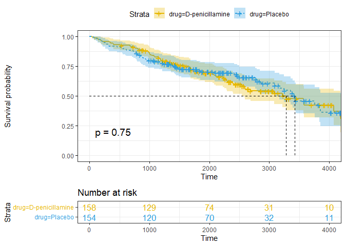
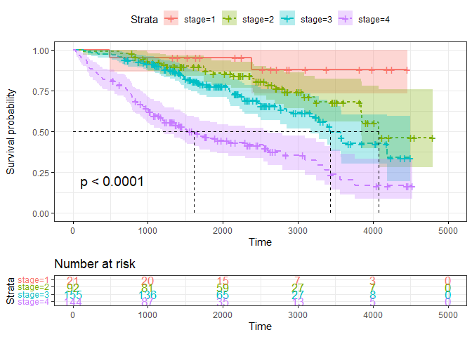
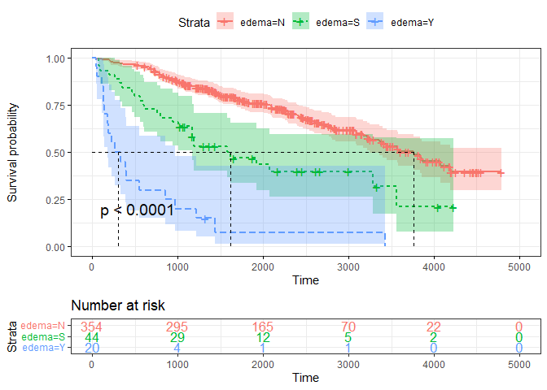

Hypothesis Test
================
Ying Jin
2022-11-02

Prepare the data

``` r
pbc_data = 
  read_csv("./cirrhosis.csv") %>% 
  janitor::clean_names() %>%
  mutate(status = as.factor(status),
         drug = as.factor(drug),
         sex = as.factor(sex),
         ascites = as.factor(ascites),
         hepatomegaly = as.factor(hepatomegaly),
         spiders = as.factor(spiders),
         edema = as.factor(edema),
         stage = as.factor(stage)) %>% 
  mutate(status=recode(status,"D" =1, "C"=0,"CL"=0))
```

    ## Rows: 418 Columns: 20
    ## ── Column specification ────────────────────────────────────────────────────────
    ## Delimiter: ","
    ## chr  (7): Status, Drug, Sex, Ascites, Hepatomegaly, Spiders, Edema
    ## dbl (13): ID, N_Days, Age, Bilirubin, Cholesterol, Albumin, Copper, Alk_Phos...
    ## 
    ## ℹ Use `spec()` to retrieve the full column specification for this data.
    ## ℹ Specify the column types or set `show_col_types = FALSE` to quiet this message.

## Test for Treatment

### Log Rank Test

Using the log rank test, we want to test whether the occurrence of death
in the D-penicillamine group ($S_1(t)$) delayed compared to the placebo
group($S_0(t)$). The hypotheses are as
below:$$H_0:S_1(t) = S_0(t)\\H_1:S_1(t) > S_0(t)$$

Conducting log rank test:

``` r
# get rid of records which have no drug info

pbc_data_1 = 
  pbc_data %>% 
  drop_na(drug)

# K-M methods
pbc_kmsurvfit_1 = 
  survfit(formula = Surv(n_days,status)~drug,data = pbc_data_1)

# plot K_m curve
ggsurvplot(pbc_kmsurvfit_1,
           pval = TRUE, conf.int = TRUE,
           risk.table = TRUE, # Add risk table
           risk.table.col = "strata", # Change risk table color by groups
           linetype = "strata", # Change line type by groups
           surv.median.line = "hv", # Specify median survival
           ggtheme = theme_bw(), # Change ggplot2 theme
           palette = c("#E7B800", "#2E9FDF"))
```

<!-- -->

``` r
# log rank test
survdiff(Surv(n_days,status)~drug,data = pbc_data_1)
```

    ## Call:
    ## survdiff(formula = Surv(n_days, status) ~ drug, data = pbc_data_1)
    ## 
    ##                        N Observed Expected (O-E)^2/E (O-E)^2/V
    ## drug=D-penicillamine 158       65     63.2    0.0502     0.102
    ## drug=Placebo         154       60     61.8    0.0513     0.102
    ## 
    ##  Chisq= 0.1  on 1 degrees of freedom, p= 0.7

Since the $P\ value$ is $0.7 > 0.05$ (significance level), we fail to
reject the null hypothesis and conclude that the survival probability in
D-penicillamine group is not significantly different from that in the
placebo group.

### Other Test

Using Gehan-Breslow generalized Wilcoxon, Tarone-Ware, Peto-Peto’s,
Fleming-Harrington test, the results are as follow:

``` r
comp(ten(pbc_kmsurvfit_1))
```

    ##                      Q         Var         Z pNorm
    ## 1          -1.7811e+00  3.1192e+01 -0.318913     2
    ## n           5.2000e+01  1.5222e+06  0.042146     6
    ## sqrtN      -1.2642e+01  6.2741e+03 -0.159603     3
    ## S1         -6.7362e-01  1.9218e+01 -0.153658     4
    ## S2         -6.6179e-01  1.9004e+01 -0.151807     5
    ## FH_p=1_q=1 -8.2787e-01  8.8617e-01 -0.879435     1
    ##               maxAbsZ        Var      Q pSupBr
    ## 1          6.1204e+00 3.1192e+01 1.0959      6
    ## n          1.6980e+03 1.5222e+06 1.3762      2
    ## sqrtN      1.0190e+02 6.2741e+03 1.2864      3
    ## S1         5.4875e+00 1.9218e+01 1.2517      5
    ## S2         5.4678e+00 1.9004e+01 1.2543      4
    ## FH_p=1_q=1 1.4582e+00 8.8617e-01 1.5490      1

We can see that using different weights, the test results are the same:
the survival probability in D-penicillamine group is not significantly
different from that in the placebo group.

These tests is unlikely to detect a difference when survival curves
cross, which is the case in our data.

## Test for Stage

### Log Rank Test

Using the log rank test, we want to test whether the occurrence of death
in different disease stage ($S_1(t)$， $S_2(t)$，$S_3(t)$ and $S_4(t)$
correspondingly) are different. The hypotheses are as
below:$$H_0:S_1(t) = S_2(t)= S_3(t)= S_4(t)\\H_1:S_1(t)，S_2(t)，S_3(t) and S_4(t)$$
are not all equal.

Conducting log rank test:

``` r
# get rid of records which have no stage info

pbc_data_2 = 
  pbc_data %>% 
  drop_na(stage)

# K-M methods
pbc_kmsurvfit_2 = 
  survfit(formula = Surv(n_days,status)~stage,data = pbc_data_2)

# plot K_m curve
ggsurvplot(pbc_kmsurvfit_2,
           pval = TRUE, conf.int = TRUE,
           risk.table = TRUE, # Add risk table
           risk.table.col = "strata", # Change risk table color by groups
           linetype = "strata", # Change line type by groups
           surv.median.line = "hv", # Specify median survival
           ggtheme = theme_bw()) # Change ggplot2 theme
```

<!-- -->

``` r
           #,palette = c("#E7B800", "#2E9FDF"))

# log rank test
survdiff(Surv(n_days,status)~stage,data = pbc_data_2)
```

    ## Call:
    ## survdiff(formula = Surv(n_days, status) ~ stage, data = pbc_data_2)
    ## 
    ##           N Observed Expected (O-E)^2/E (O-E)^2/V
    ## stage=1  21        2     11.4      7.78      8.46
    ## stage=2  92       23     44.1     10.12     14.25
    ## stage=3 155       48     61.3      2.87      4.73
    ## stage=4 144       84     40.2     47.81     65.29
    ## 
    ##  Chisq= 70.1  on 3 degrees of freedom, p= 4e-15

Since the $P\ value$ is $4\times10^{-15} < 0.05$ (significance level),
we reject the null hypothesis and conclude that at least two of the
survival probability from the four disease stage groups is significantly
different.

### Other Test

Using Gehan-Breslow generalized Wilcoxon, Tarone-Ware, Peto-Peto’s,
Fleming-Harrington test, the results are as follow:

``` r
comp(ten(pbc_kmsurvfit_2))
```

    ##             chiSq df pChisq
    ## 1          70.076  3      3
    ## n          76.260  3      1
    ## sqrtN      76.118  3      1
    ## S1         75.828  3      1
    ## S2         75.883  3      1
    ## FH_p=1_q=1 37.803  3      2
    ## $tft
    ##                     Q        Var      Z pNorm
    ## 1          4.6098e+01 1.2700e+02 4.0905     6
    ## n          1.6411e+04 1.0208e+07 5.1364     5
    ## sqrtN      8.7220e+02 3.2290e+04 4.8538     2
    ## S1         4.1247e+01 7.6974e+01 4.7014     4
    ## S2         4.1153e+01 7.6255e+01 4.7126     3
    ## FH_p=1_q=1 4.2507e+00 3.7558e+00 2.1934     1
    ## 
    ## $scores
    ## [1] 1 2 3 4

We can see that using different weights, the test results are consistent
with that of the log rank test.

Then we conduct multiple pairwise comparisons to see which groups have
different survival probability.

``` r
res_2 = pairwise_survdiff(Surv(n_days,status)~stage,data = pbc_data_2, p.adjust.method = "bonferroni",rho = 0)

res_2
```

    ## 
    ##  Pairwise comparisons using Log-Rank test 
    ## 
    ## data:  pbc_data_2 and stage 
    ## 
    ##   1       2       3      
    ## 2 0.63827 -       -      
    ## 3 0.09048 0.33460 -      
    ## 4 0.00018 3.2e-09 7.8e-08
    ## 
    ## P value adjustment method: bonferroni

``` r
symnum(res_2$p.value, cutpoints = c(0, 0.0001, 0.001, 0.01, 0.05, 0.1, 1),
   symbols = c("****", "***", "**", "*", "+", " "),
   abbr.colnames = FALSE, na = "")
```

    ##   1   2    3   
    ## 2              
    ## 3 +            
    ## 4 *** **** ****
    ## attr(,"legend")
    ## [1] 0 '****' 1e-04 '***' 0.001 '**' 0.01 '*' 0.05 '+' 0.1 ' ' 1 \t    ## NA: ''

Base on above results， we can tell that the survival chance for
patients in stage 4 is significantly lower than that of other patients,
which can be seen clearly in the KM curve.

## Test for Edema

### Log Rank Test

Using the log rank test, we want to test whether the occurrence of death
for patients with different edema status ($S_N(t)$， $S_S(t)$ and
$S_Y(t)$ correspondingly) are different. The hypotheses are as
below:$$H_0:S_N(t) = S_S(t)= S_Y(t)\\H_1:S_N(t)，S_S(t)，and S_Y(t)$$
are not all equal.

Conducting log rank test:

``` r
# get rid of records which have no edema info

pbc_data_3 = 
  pbc_data %>% 
  drop_na(edema)

# K-M methods
pbc_kmsurvfit_3 = 
  survfit(formula = Surv(n_days,status)~edema,data = pbc_data_3)

# plot K_m curve
ggsurvplot(pbc_kmsurvfit_3,
           pval = TRUE, conf.int = TRUE,
           risk.table = TRUE, # Add risk table
           risk.table.col = "strata", # Change risk table color by groups
           linetype = "strata", # Change line type by groups
           surv.median.line = "hv", # Specify median survival
           ggtheme = theme_bw()) # Change ggplot2 theme
```

<!-- -->

``` r
           #,palette = c("#E7B800", "#2E9FDF"))

# log rank test
survdiff(Surv(n_days,status)~edema,data = pbc_data_3)
```

    ## Call:
    ## survdiff(formula = Surv(n_days, status) ~ edema, data = pbc_data_3)
    ## 
    ##           N Observed Expected (O-E)^2/E (O-E)^2/V
    ## edema=N 354      116   145.47      5.97      62.3
    ## edema=S  44       26    13.05     12.84      14.0
    ## edema=Y  20       19     2.47    110.44     113.1
    ## 
    ##  Chisq= 131  on 2 degrees of freedom, p= <2e-16

Since the $P\ value$ is $2\times10^{-16} < 0.05$ (significance level),
we reject the null hypothesis and conclude that at least two of the
survival probability from the three edema groups is significantly
different.

### Other Test

Using Gehan-Breslow generalized Wilcoxon, Tarone-Ware, Peto-Peto’s,
Fleming-Harrington test, the results are as follow:

``` r
comp(ten(pbc_kmsurvfit_3))
```

    ##              chiSq df pChisq
    ## 1          130.592  2      1
    ## n          148.876  2      1
    ## sqrtN      143.841  2      1
    ## S1         143.834  2      1
    ## S2         143.909  2      1
    ## FH_p=1_q=1  39.896  2      2
    ## $tft
    ##                      Q         Var       Z pNorm
    ## 1          -4.2420e+01  4.9383e+01 -6.0364     3
    ## n          -1.4948e+04  4.8240e+06 -6.8058     2
    ## sqrtN      -7.8798e+02  1.4287e+04 -6.5925     4
    ## S1         -3.7340e+01  3.2701e+01 -6.5296     6
    ## S2         -3.7223e+01  3.2447e+01 -6.5347     5
    ## FH_p=1_q=1 -3.8731e+00  1.2044e+00 -3.5291     1
    ## 
    ## $scores
    ## [1] 1 2 3

We can see that using different weights, the test results are consistent
with that of the log rank test.

Then we conduct multiple pairwise comparisons to see which groups have
different survival probability.

``` r
res_3 = pairwise_survdiff(Surv(n_days,status)~edema,data = pbc_data_3, p.adjust.method = "bonferroni",rho = 0)
res_3
```

    ## 
    ##  Pairwise comparisons using Log-Rank test 
    ## 
    ## data:  pbc_data_3 and edema 
    ## 
    ##   N       S    
    ## S 2.2e-05 -    
    ## Y < 2e-16 1e-04
    ## 
    ## P value adjustment method: bonferroni

``` r
symnum(res_3$p.value, cutpoints = c(0, 0.0001, 0.001, 0.01, 0.05, 0.1, 1),
   symbols = c("****", "***", "**", "*", "+", " "),
   abbr.colnames = FALSE, na = "")
```

    ##   N    S  
    ## S ****    
    ## Y **** ***
    ## attr(,"legend")
    ## [1] 0 '****' 1e-04 '***' 0.001 '**' 0.01 '*' 0.05 '+' 0.1 ' ' 1 \t    ## NA: ''

Base on above results， we can tell that the survival chance for
patients in the three edema groups is all different. In addition,
according to the KM plot，we can see the trend is:
$S_N(t)>S_S(t)>S_Y(t)$
